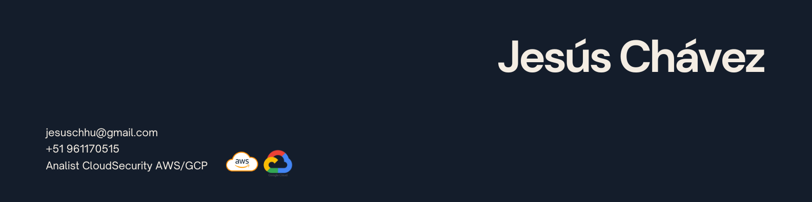

  

## Who Am I?

<table>
<tr>
<td width="35%">

</td>
<td width="65%" valign="top">

I'm a final-year Systems Engineering student at UNASAM, specializing in **Cloud Security** — where I've found the intersection that actually excites me: protecting infrastructure at scale, not just understanding it.

My journey has been anything but linear. I've built SIEM architectures on AWS, simulated ransomware environments across six VMs on GCP, deployed AI-powered systems using Amazon Bedrock, and led a university cybersecurity community from the ground up. Along the way I've learned that the most interesting problems live at the edge — where cloud, security, and real organizational needs collide.

Right now I'm finishing my thesis — designing an AWS-native SIEM architecture for my university's research division — while building hands-on labs, giving talks, and stacking certifications (eJPT, Aviatrix ACE Multicloud, AWS Academy Cloud Security Foundations). I don't come from a programming background and I don't pretend to — my edge is architectural thinking, threat modeling, and knowing how to make cloud services work defensively.

I'm not looking to be a generalist. I'm building toward one thing: becoming a **Cloud Security specialist** who actually understands the infrastructure he's protecting.

</td>
</tr>
</table>
